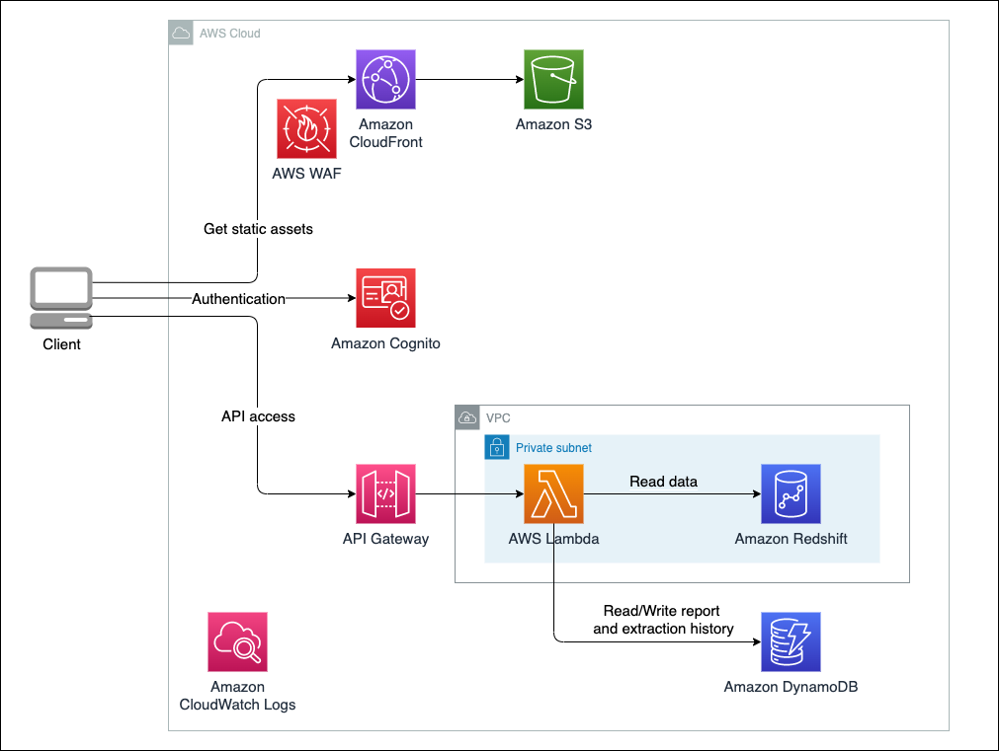

# Data Exporter

Data exporter is a solution for extracting and downloading data from datawarehouses (Redshift) by specifying conditions with a simple user interface, without the need to write SQL or code.

## Demo


## Features

- Easy data extraction
  - Data exporter provides a user-friendly interface that enables you to effortlessly specify conditions and retrieve data without the need to write SQL or code.
- Query template (Report)
  - You can create reusable query templates (= report) that can be shared with others, facilitating collaboration and saving time.
- Query history
  - Data Exporter automatically saves your query history.
- Multilingual Support
  - Data Exproter supports multiple languages (English and Japanese).
- Permission Control
  - You can control data permisson of users. (At this time, it is possilbe to set whether or not a user has data export privileges).

## Architecture



## Getting started

### Prerequisites

- Configuration of AWS profile
- `cdk` command
  - Before installing `cdk` command, you need to install Node.js (Active LTS version preferred) on your machine.
  - You can install `cdk` with `npm install -g aws-cdk`.
- Docker
  - Docker is used to create packages for Lambda functions.

### Deployment

#### 1. CDK Setup

The first step is to set up CDK. This step is required when using CDK for the first time for each AWS account and region. If you have already done so, you may skip this step.

```bash
cdk bootstrap
```

AWS WAF for CloudFront is only available in `us-east-1` (see [reference](https://docs.aws.amazon.com/AWSCloudFormation/latest/UserGuide/aws-resource-wafv2-webacl.html).) If you have done the above setup in a region other than `us-east-1`, you also need to set up for `us-east-1` with the command below.

```bash
cdk bootstrap --region us-east-1
```

#### 2. Backend Deployment

Move to backend directory, and execute the following commands to install backend modules.

```bash
cd backend
npm ci
```

Once modules are installed, deploy backend resources defined by CDK with the following command.

```bash
cdk deploy --all
```

If the deployment completes successfully, you will get outputs like below. These values will be used in the following steps.

```bash
Outputs:
BackendStack.AuthUserPoolClientIdxxx = xxxxx
BackendStack.AuthUserPoolIdxxx = ap-northeast-1_xxxxx
BackendStack.BackendApiEndpointxxx = https://xxxxx.execute-api.ap-northeast-1.amazonaws.com/api/
```

#### 3. Frontend Deployment

First, set the `context` in `frontend/cdk/cdk.json` to the values you got when deploying the backend. These values can also be found in the "Output" tab of the [CloudFormation Console](https://console.aws.amazon.com/cloudformation/).

```json
"context": {
  "userPoolId": "Cognito User Pool ID",
  "userPoolClientId": "Cognito User Pool Client ID",
  "allowedIpAddressRanges": [
    "0.0.0.0/0" // Specify in CIDR format
  ],
  // ...
}
```

Execute the following commands to install frontend modules.

```bash
cd frontend/cdk/
npm ci
```

Once modules are installed, deploy frontend resources defined by CDK with the following command. React programs are automatically built before deployment begins.

```bash
cdk deploy --all
```

When the deployment is successfully completed, the following outputs will be displayed. You have access to frontend website with this URL.

```
Outputs:
FrontendStack.CloudFrontURL = https://xxxxxx.cloudfront.net
```

#### 4. Creation of Cognito user

To login the website, you need to craete a Cognito user. In [Cognito Console](https://console.aws.amazon.com/cognito/v2/idp/user-pools/), create user with your email and password.

After creation, you need to setup the custom attribute for a user. In the user page, click [User attributes] -> [Edit], and set [custom:Downloadable] to True or False. With this attribute, you can control who can export the table.

You may also create a user with the attribute via AWS CLI.

```bash
aws cognito-idp admin-create-user  --user-pool-id "Cognito User Pool ID" --username "Email Address" --user-attributes "Name=custom:Downloadable,Value=True" --temporary-password "Temporary Password"
```

## Documentation

You can access the following links for more information on frontend development and backend API and DB design.

- [Frontend](docs/FRONTEND.md)
- [Backend](docs/BACKEND.md)
